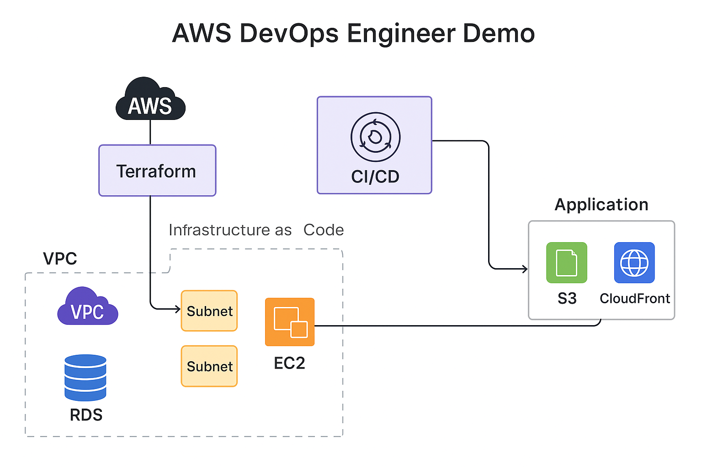

# AWS DevOps Engineer Demo Project

## Objective
This project demonstrates the ability to **design, deploy, and automate infrastructure and applications** using AWS and Terraform, following DevOps best practices. The demo includes:

- Infrastructure as Code (IaC) using Terraform
- CI/CD pipeline setup
- Containerized deployment (optional)
- Security best practices
- Monitoring/logging setup

---

## Architecture Diagram
  
*(Use draw.io or Lucidchart to create the diagram and save it in `docs/` folder)*

---

## Tech Stack Justification

| Component         | Tool / Service       | Reason                                                                 |
|-------------------|----------------------|------------------------------------------------------------------------|
| Infrastructure    | Terraform            | Reproducible IaC, modular, environment separation (dev/staging/prod)   |
| Cloud Provider    | AWS                  | Industry standard, rich services for DevOps                            |
| Compute           | EC2                  | Easily deploy web servers and apps                                     |
| Database          | RDS (MySQL/Postgres) | Managed relational DB, highly available                                |
| Networking        | VPC/Subnets/SG       | Secure network isolation and traffic control                           |
| CI/CD             | GitHub Actions / AWS CodePipeline | Automates build, test, deploy, rollback                   |
| Hosting           | EC2 / S3 / CloudFront | EC2 for dynamic apps, S3 + CloudFront for static content              |
| Monitoring        | CloudWatch           | Logs, metrics, and alerts                                              |
| Secrets & IAM     | AWS IAM              | Role-based access, no hard-coded credentials                           |

---

## GitHub Repo Structure

/iac → Terraform code for VPC, EC2, RDS

## Initialize Terraform

```bash
terraform init
```

## Plan Infrastructure

```bash
terraform plan -var-file="dev.tfvars"
```

## Apply Infrastructure

```bash
terraform apply -var-file="dev.tfvars"
```

## Access the Demo App

If using EC2:

Open your browser and navigate to the public IP of the EC2 instance

If using S3/CloudFront:

Access the CloudFront URL for the static site

Demo login credentials (if app included):

```bash
Email: hire-me@anshumat.org
Password: HireMe@2025!
```

## Features Implemented

Modular Terraform code (VPC, EC2, RDS)

Environment separation (dev/staging/prod)

CI/CD pipeline with automated build, test, deploy

User-data script for EC2 bootstrapping

Security best practices (IAM roles, no hard-coded secrets)

Monitoring and logging via CloudWatch

Optional: Auto-scaling, Blue/Green deployment, or Canary releases

## Notes

Ensured the key pair exists in AWS before applying the Terraform plan

All resources are region-specific; adjust ami_id and azs according to your region

For any issues, check Terraform logs and AWS CloudWatch

## Architecture diagram


